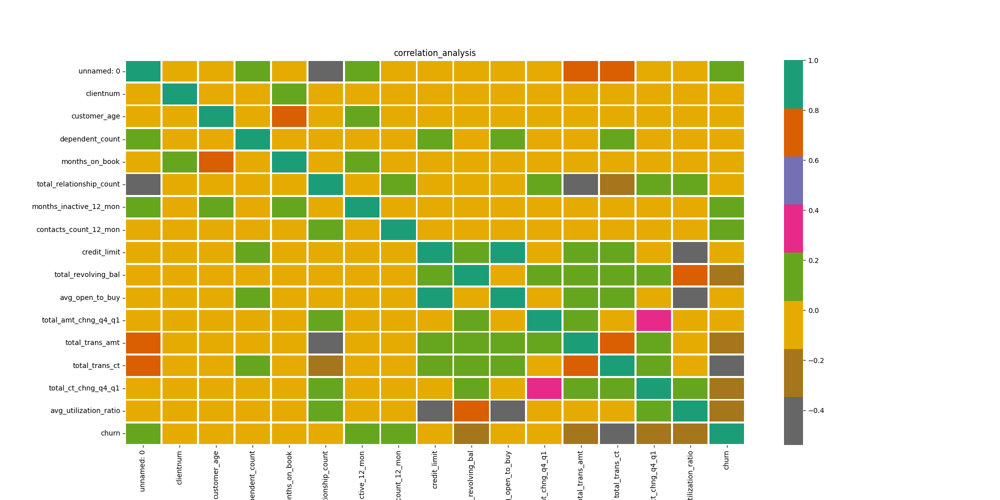

# Predict Customer Churn

- Project **Predict Customer Churn** of ML DevOps Engineer Nanodegree Udacity

## Pre-requisites
Prerequisites:
* Python 3.8
* Git

0. (Recommendation) Create and activate a virtual environment

    ```bash
    python3 -m venv .venv
    source .venv/bin/activate
    ```

1. Install dependencies

    ```
    pip install requirements.text
    ```

## Project Description
This project yiedls a machine learning pipeline which train two different classifiers for customer chrun prediction. The main steps performed by the pipeline are listed below:

 - Performs exploratory data analysis (EDA)
 - Performs Feature Engineering
 - Train Models with a grid of hyperparameters
 - Finds and saves optimal model
 - Export Evaluation metrics 



## Files and data description
Overview of the files and data present in the root directory

 - main.py : contains all the steps for the machine learning pipeline
 - tests.py: pytests developed for the project
 - constants.py: constants used on main.py
 - models.py: classification models
 - data/: raw data used for feature engineering and eda
 - logs/: logs generated by tests.py
 - models/: serialized saved models
 - images/: images and results saved by eda and results analysis

## Running Files
In order to run the main training pipeline for predicting customer churn, please use the following command:

```
ipython main.py
```
To run all the tests required with pytest, run the following below:

```
pytest tests.py -p no:logging
```


